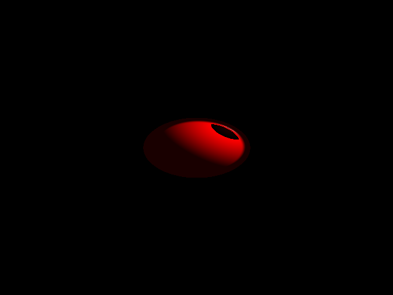

# GPT-RAY

Although I have a solid 10 years programming experience, I have no prior knowledge of light transport and rendering software. 

So I thought why not let ChatGPT help me write a raytracer.

The basis of the code, up until the point it could output an image for the first time, was generated within one and a half hours!
This is the initial render, personally I think this is amazing, although there are probably some errors in the code.

#### Further work

As I am in no position to judge the correctness of the code (I am, though, but I will pretend not to be, for the sake of the experiment), I will have to improve iteratively through further chat interaction...

