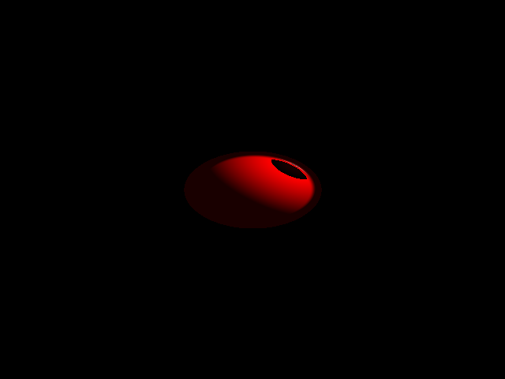
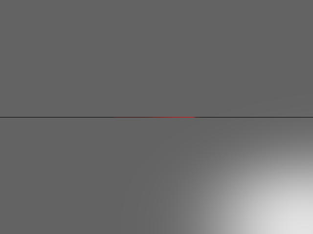
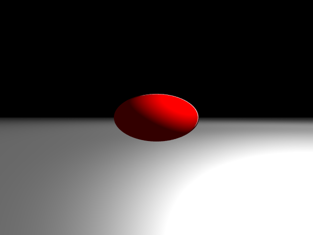
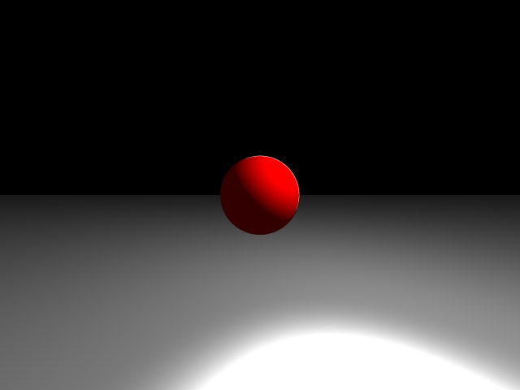
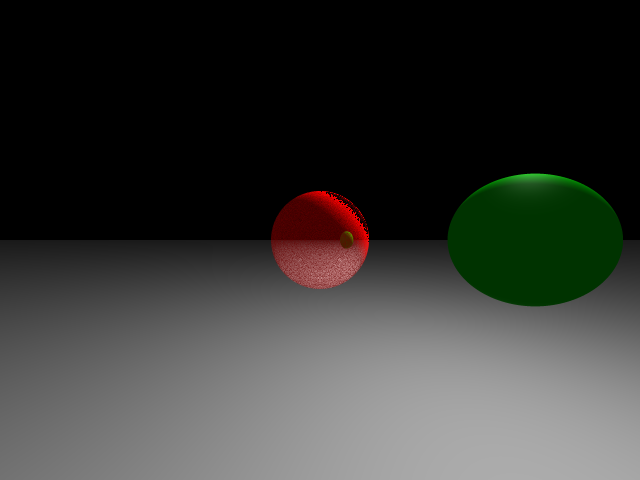
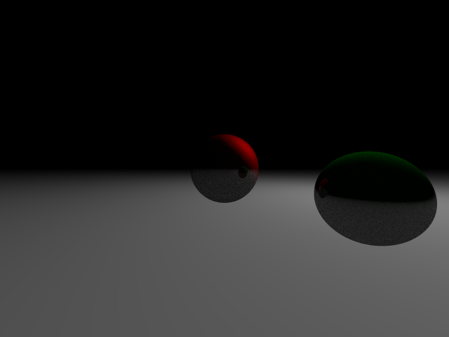
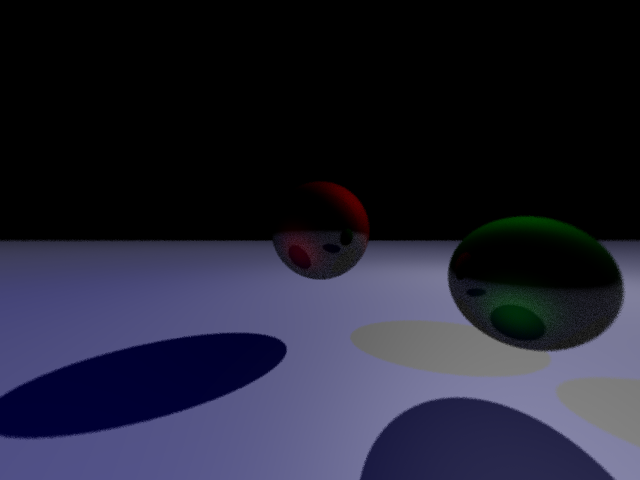

# GPT-RAY

An experiment to learn how to best interact with this amazing new tool.

### Introduction

Although I have a solid 10 years programming experience, I have no prior knowledge of light transport and rendering software. 

So I thought why not let ChatGPT help me write a raytracer.

As I am in no position to judge the correctness of the code (or at least I will pretend not to be, for the sake of the experiment), I will have to try to keep improving iteratively through further chat interaction.

#### 01. Initial render

The basis of the code, up until the point it could output an image for the first time, was generated within one and a half hours!
This is the initial render, personally I think this is an amazing result in such a small timeframe, although there are probably errors in the code.

#### 02. Clamping

Adding clamping clearly improves the output image.

#### 03. Adding a Plane

Adding a plane to the scene seems to create a proper mess. Time for some chat guided debugging...

#### 04. Positioning

After correctly positioning the plane and sphere, and adding field of view, the output looks better, but it looks like a new kind of clipping has been introduced.

#### 05. Multisampling

Adding multisampling to improve the output quality.

#### 06. Aspect Ratio Fix

Fixed a bug with the aspect ratio calculation and lowered the ground plane a bit.

#### 07. Improved multisampling

Improved the multisampling method by asking for a different method.

#### 08. Improving the `Shade` function

Improving the shade function by trying to incorporate transparency, refraction, reflection, diffusion and specular light.

Also adding a recursion depth limit to prevent stackoverflow. It currently looks far from perfect, but it is a decent start.

#### 09. Improving the shade functions

After having split up the `Shade` function into separate parts, I could optimize and tweak them individually.

#### 10. Further improvements

I have rewritten the shader functions, but this required a lot of debugging. And some aspects still feel incorrect/off.

At this point I'm not sure whether it is any good to continue down this path; I feel like I need to learn more about raytracing myself before I can redirect the AI to find potential bugs.

But then I could have just written the code myself...

### Interlude

Now that the overall structure of the code is clear to me, I decided that the next best thing to do would be to learn some more about the subject, and then try to work with GPT again to improve certain parts of the code.

